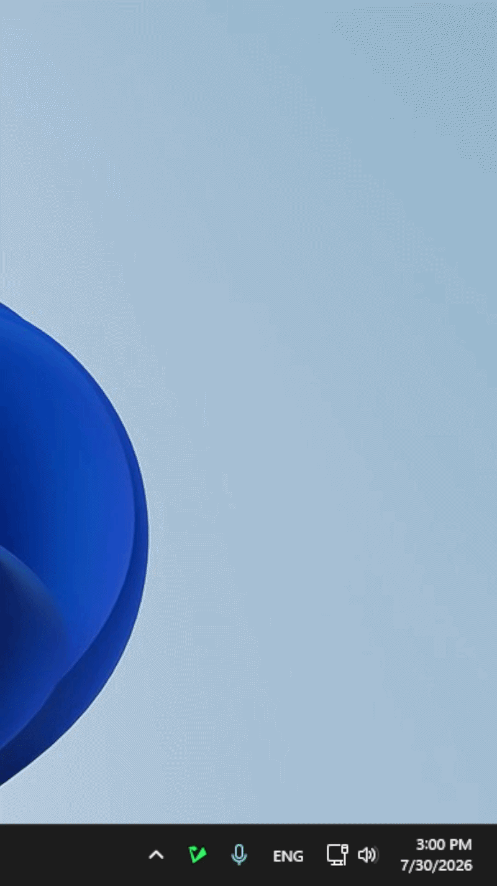

# closta

> concise, light, open source tracking app.

simple tracker to track little tasks that you might set yourself.




made using python and dearpygui gui lib. currently only windows :P

tested on a 1080p screen with 100% scale. issues may arise with larger screens/scales

---

## usage guide

### download from releases

you can download the exe or the archive. the standalone exe has a high chance of getting flagged by defender.

- **standalone exe** – double click to run. closta icon will be spotted in the tray.
- **archive** – extract to a local folder, such as documents or desktop. then run exe. closta icon will be spotted in tray.

### building an exe with nuitka

1. `git clone https://github.com/greenImporting/closta.git`
2. run `.\BUILD_NUITKA_ONEFILE.ps1`

### running from source

1. check if uv is installed. if not: install using (open powershell):
   ```powershell
   powershell -ExecutionPolicy ByPass -c "irm https://astral.sh/uv/install.ps1 | iex"
   ```
2. `uv sync`
3. `.venv\scripts\activate`
4. run `src\closta\tray\tray.py`

---

## known issues

- no text wrap for creating and editing tasks; issue with dearpygui
- fixed task child window height; skill issue/dearpygui issue (just imagine its like a post-it note)

---

## todo

- add a heirarchy system for showing more important tasks towards the top
- add support for scheduling, such as time and dates
- add debounce, after that, clicking closta tray will close window instead of reopen new one.

---

## acknowledgement

<small>this project used deepseek for documentation assistance. minor portions of code were ai generated and subsequently modified and reviewed by me.</small>