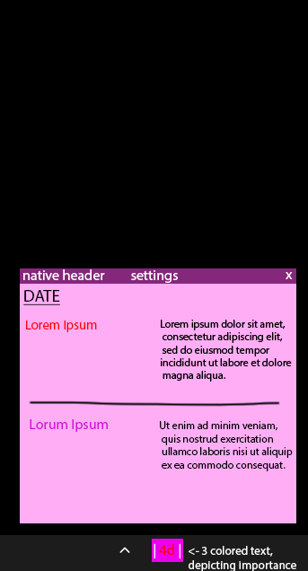

## what ever should i do?

simple notes+reminders app for windows (+ linux?) that lives in the taskbar.

idea: written in a high level language, such as python, using libs for window such as dear py gui. have a small icon in taskbar that spawns a bigger window with main content on click.

### idea:

(obviously better color choices will be made but its a mockup!!! give me some credit...)

## checklist
### main window
- [x] create prim window
- [x] destroys after unfocus
- [/] main content
- [x] task/tracking logic
- [x] storage

### taskbar
- [x] tray icon
- [x] tray anything LOL
- [x] open window using tray icon
- [ ] window location spawn control
- [x] focus on open?

